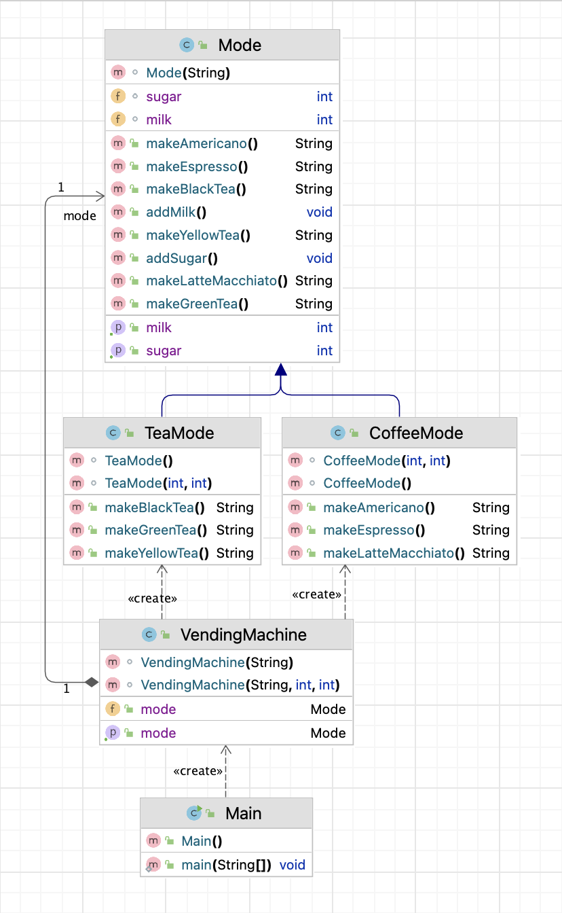

# Project Name

Fully Automatic Beverage Vending Machine

## Project Structure

```
./src
├── /main
│   ├── Main.java
│   ├── VendingMachine.java
│   ├── Mode.java
│   ├── TeaMode.java
│   └── CoffeeMode.java
│
└── /test
    └── Test.java
```

The workspace is structured in following:

- `/src` : a folder to maintain source codes.
    - `main` : a folder to mainly implement project solution.
        - `Main` : used to create VendingMachine object with inputting amount of milk and sugar, finally, make a kind of beverage of coffee or tea.
        - `VendingMachine` : provides two modes, coffee or tea.
        - `Mode` : in the `Mode` object, it stores instance variables and instance methods to its child classes to be overridden.
        - `TeaMode` : `makeBlackTea`, `makeGreenTea`, `makeYellowTea` are the three functions that will return String message after creating beverage, and after that, the milk and sugar will be consumed to 0. 
        - `CoffeeMode` : `makeEspresso`, `makeAmericano`, `makeLatteMacchiato` are the three functions that will return String message after creating beverage, and after that, the milk and sugar will be consumed to 0.
    - `test` : a folder to maintain testcases.
      - `Test` : created 5 testcases to assert the inputs and outputs.

## Diagram



# How to compile the project

We use Apache Maven to compile and run this project. 

You need to install Apache Maven (https://maven.apache.org/)  on your system. 

Type on the command line: 

```bash
mvn clean compile
```

# How to create a binary runnable package 


```bash
mvn clean compile assembly:single
```


# How to run

```bash
mvn -q clean compile exec:java -Dexec.executable="edu.bu.met.cs665.Main" -Dlog4j.configuration="file:log4j.properties"
```

# Run all the unit test classes.


```bash
mvn clean compile test checkstyle:check  spotbugs:check
```

# Using Spotbugs to find bugs in your project 

To see bug detail using the Findbugs GUI, use the following command "mvn findbugs:gui"

Or you can create a XML report by using  


```bash
mvn spotbugs:gui 
```

or 


```bash
mvn spotbugs:spotbugs
```


```bash
mvn spotbugs:check 
```

check goal runs analysis like spotbugs goal, and make the build failed if it found any bugs. 


For more info see 
https://spotbugs.readthedocs.io/en/latest/maven.html


SpotBugs https://spotbugs.github.io/ is the spiritual successor of FindBugs.


# Run Checkstyle 

CheckStyle code styling configuration files are in config/ directory. Maven checkstyle plugin is set to use google code style. 
You can change it to other styles like sun checkstyle. 

To analyze this example using CheckStyle run 

```bash
mvn checkstyle:check
```

This will generate a report in XML format


```bash
target/checkstyle-checker.xml
target/checkstyle-result.xml
```

and the following command will generate a report in HTML format that you can open it using a Web browser. 

```bash
mvn checkstyle:checkstyle
```

```bash
target/site/checkstyle.html
```


