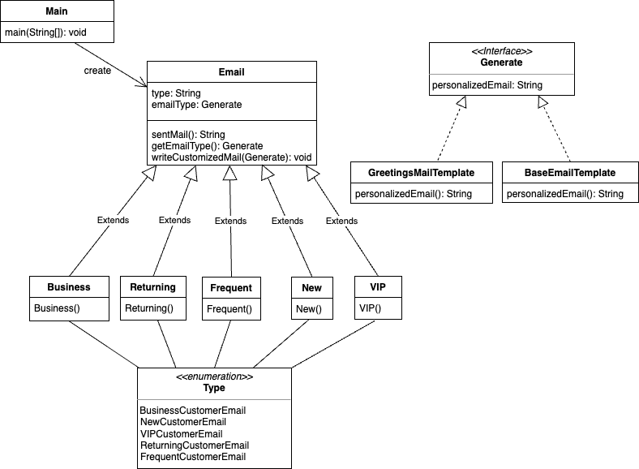

| CS-665     | Software Design & Patterns |
|------------|----------------------------|
| Name       | Yi-Yang Lin                |
| Date       | 03/16/2023                 |
| Course     | Spring                     |
| Assignment | 3                          |

# Project Name

Email Generation Application

# Assignment Overview

In this project, it is designed to implement strategy pattern to a custom application that can 
automatically generate emails based on templates, and for each type of customer, the message is 
editable and to override the default mail content.

# Project Structure

```
./src
├── /main
│   ├── Main.java
│   ├── Email.java
│   ├── Tpye.java
│   ├── BaseEmailTemplate.java
│   ├── GreetingsMailTemplate.java
│   ├── Business.java
│   ├── Frequent.java
│   ├── New.java
│   ├── Returning.java
│   ├── VIP.java
│   └── Generate.java
│
└── /test
    └── Test.java
```

The workspace is structured in following:

- `/src` : a folder to maintain source codes.
    - `main` : a folder to mainly implement project Classes.
        - `Main` : To implement Email Generation Application System project solution.
        - `Email` : A general parent class that serves as a template for Business, Frequent, New,
          Returning, VIP classes.
        - `Type` : Instead of using string literals to represent the different types of
          customer emails, we can use the more descriptive names defined in
          the enumeration type. This also helps to avoid errors that
          can occur when using string literals, such as typos or case sensitivity issues.
        - `BaseEmailTemplate` : Provides a shorter greeting message for informal New, Frequent
          customer email message.
        - `GreetingsMailTemplate` : Provides a formal greeting message for Business, Returning,
          VIP customer email messages.
        - `Business` : This Business class is to implement general template for business customer,
          if the formal greeting template is overridden by the other Generate object message, the
          sentMail() from the parent method will save the customized mail content.
        - `Frequent` : This Frequent class is to implement general template for Frequent customer,
          if the informal greeting template is overridden by the other Generate object message, the
          sentMail() from the parent method will save the customized mail content.
        - `New` : This New class is to implement general template for New customer, if the informal
          greeting template is overridden by the other Generate object message, the sentMail() from
          the parent method will save the customized mail content.
        - `Returning` : This Returning class is to implement general template for Returning customer,
          if the formal greeting template is overridden by the other Generate object message, the
          sentMail() from the parent method will save the customized mail content.
        - `VIP` : This VIP class is to implement general template for VIP customer, if the formal
          greeting template is overridden by the other Generate object message, the sentMail() from
          the parent method will save the customized mail content.
        - `Generate` : The Generate interface class is to be created to define personalized Email content.

    - `test` : a folder to maintain testcases.
        - `Test` : created 5 testcases to assert the inputs and outputs.

# Diagram



# Implementation Description

- Explain the level of flexibility in your implementation, including how new object types can be
  easily added or removed in the future.
  - There are two basic templates that various customer email class will default implement.
  The Generate object class can be created and pass in to each customer class to change the
  content of the sent emails.
- Discuss the simplicity and understandability of your implementation, ensuring that it is
  easy for others to read and maintain.
  - There is a general parent type `Email` and its children classes `Business`, `Frequent`, `New`,
  `Returning`, `VIP`, to decide using the default templates `BaseEmailTemplate` or `GreetingsMailTemplate`.
  - The `Generate` is an interface to edit the message if the default mail template is not needed.
- Describe how you have avoided duplicated code and why it is important.
  - The general parent class provides methods to be implemented to children classes, so the children do not
  need to create several methods.
- If applicable, mention any design patterns you have used and explain why they were
  chosen.
  - Strategy design pattern is mainly used in this project.
  - Strategy design pattern allows selecting an algorithm at runtime. It enables encapsulating algorithms 
  within classes and making them interchangeable, as the same as general `Email` class, that has interface 
  methods in `Generate` class to change the mail content interchangeably.

# Maven Commands

We'll use Apache Maven to compile and run this project. You'll need to install Apache Maven (https://maven.apache.org/)
on your system.

Apache Maven is a build automation tool and a project management tool for Java-based projects. Maven provides a
standardized way to build, package, and deploy Java applications.

Maven uses a Project Object Model (POM) file to manage the build process and its dependencies. The POM file contains
information about the project, such as its dependencies, the build configuration, and the plugins used for building and
packaging the project.

Maven provides a centralized repository for storing and accessing dependencies, which makes it easier to manage the
dependencies of a project. It also provides a standardized way to build and deploy projects, which helps to ensure that
builds are consistent and repeatable.

Maven also integrates with other development tools, such as IDEs and continuous integration systems, making it easier to
use as part of a development workflow.

Maven provides a large number of plugins for various tasks, such as compiling code, running tests, generating reports,
and creating JAR files. This makes it a versatile tool that can be used for many different types of Java projects.

## Compile

Type on the command line:

```bash
mvn clean compile
```

## JUnit Tests

JUnit is a popular testing framework for Java. JUnit tests are automated tests that are written to verify that the
behavior of a piece of code is as expected.

In JUnit, tests are written as methods within a test class. Each test method tests a specific aspect of the code and is
annotated with the @Test annotation. JUnit provides a range of assertions that can be used to verify the behavior of the
code being tested.

JUnit tests are executed automatically and the results of the tests are reported. This allows developers to quickly and
easily check if their code is working as expected, and make any necessary changes to fix any issues that are found.

The use of JUnit tests is an important part of Test-Driven Development (TDD), where tests are written before the code
they are testing is written. This helps to ensure that the code is written in a way that is easily testable and that all
required functionality is covered by tests.

JUnit tests can be run as part of a continuous integration pipeline, where tests are automatically run every time
changes are made to the code. This helps to catch any issues as soon as they are introduced, reducing the need for
manual testing and making it easier to ensure that the code is always in a releasable state.

To run, use the following command:

```bash
mvn clean test
```

## Spotbugs

SpotBugs is a static code analysis tool for Java that detects potential bugs in your code. It is an open-source tool
that can be used as a standalone application or integrated into development tools such as Eclipse, IntelliJ, and Gradle.

SpotBugs performs an analysis of the bytecode generated from your Java source code and reports on any potential problems
or issues that it finds. This includes things like null pointer exceptions, resource leaks, misused collections, and
other common bugs.

The tool uses data flow analysis to examine the behavior of the code and detect issues that might not be immediately
obvious from just reading the source code. SpotBugs is able to identify a wide range of issues and can be customized to
meet the needs of your specific project.

Using SpotBugs can help to improve the quality and reliability of your code by catching potential bugs early in the
development process. This can save time and effort in the long run by reducing the need for debugging and fixing issues
later in the development cycle. SpotBugs can also help to ensure that your code is secure by identifying potential
security vulnerabilities.

Use the following command:

```bash
mvn spotbugs:gui 
```

For more info see
https://spotbugs.readthedocs.io/en/latest/maven.html

SpotBugs https://spotbugs.github.io/ is the spiritual successor of FindBugs.

## Checkstyle

Checkstyle is a development tool for checking Java source code against a set of coding standards. It is an open-source
tool that can be integrated into various integrated development environments (IDEs), such as Eclipse and IntelliJ, as
well as build tools like Maven and Gradle.

Checkstyle performs static code analysis, which means it examines the source code without executing it, and reports on
any issues or violations of the coding standards defined in its configuration. This includes issues like code style,
code indentation, naming conventions, code structure, and many others.

By using Checkstyle, developers can ensure that their code adheres to a consistent style and follows best practices,
making it easier for other developers to read and maintain. It can also help to identify potential issues before the
code is actually run, reducing the risk of runtime errors or unexpected behavior.

Checkstyle is highly configurable and can be customized to fit the needs of your team or organization. It supports a
wide range of coding standards and can be integrated with other tools, such as code coverage and automated testing
tools, to create a comprehensive and automated software development process.

The following command will generate a report in HTML format that you can open in a web browser.

```bash
mvn checkstyle:checkstyle
```

The HTML page will be found at the following location:
`target/site/checkstyle.html`
